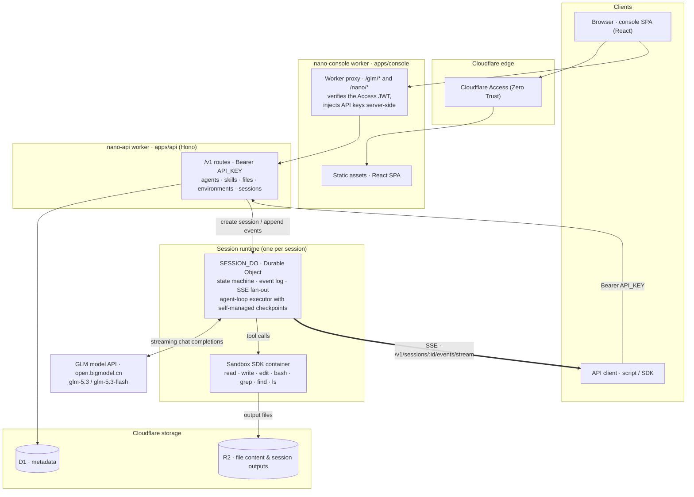

<div align="center">

# nano-managed-agent

**A minimal managed-agent runtime, built entirely on Cloudflare.**

[](LICENSE)
[](https://nodejs.org/)
[](https://pnpm.io/)
[](https://workers.cloudflare.com/)
[](https://vitest.dev/)

**English** · [简体中文](README.zh-CN.md)

</div>

---

## What is this project?

Hosted agent platforms offer a compelling deal: you define an agent over a REST API, start a stateful session, and the platform takes care of everything after that. It drives the agent loop turn by turn, executes the model's tool calls inside a sandbox, streams every step back to you as events, and keeps the session durable across crashes and redeploys.

**nano-managed-agent** is a from-scratch, self-hostable implementation of that core loop, built entirely on Cloudflare's developer platform:

> **Define an agent over the API → start a stateful session → the platform drives the agent loop → tools execute in a sandbox → you interact through an SSE event stream.**

Every building block is a managed primitive — Workers as the API gateway, one Durable Object per session as the runtime, D1 as the metadata store, R2 for file storage, Containers as the tool sandbox — so the whole system is a modest amount of TypeScript that you can read in an afternoon, deploy with one command, and own end to end. The wire protocol intentionally mirrors the shape of GLM Managed Agents, which makes it easy to swap between the hosted service and this self-hosted runtime in the bundled console.

### Highlights

- **A complete REST control plane.** The `/v1` API (Bearer-authenticated, Hono) exposes 39 endpoints across five resources — agents, skills, files, environments and sessions. Every response goes through zod schemas shared between client and server, list endpoints use keyset pagination with opaque cursors, and every error is wrapped in a consistent envelope that carries a `request_id` for tracing.
- **A real agent runtime, not a mock.** Each session is a single-writer Durable Object that owns the state machine, the append-only event log, SSE fan-out, and the agent-loop executor. The executor manages its own two-level checkpoints and recovers by itself — Durable Object eviction and daily code redeploys are treated as normal occurrences rather than exceptions, and an end-to-end test kills the process with SIGKILL mid-turn to prove that recovery works.
- **Sandboxed tool execution.** The seven built-in tools (`bash`, `read`, `write`, `edit`, `grep`, `find`, `ls`) run inside a per-session container powered by the Cloudflare Sandbox SDK, started on demand and reclaimed after ten idle minutes. Skills are mounted at `/mnt/skills` and uploaded files at `/mnt/session/uploads`, both read-only; everything the agent writes to `/mnt/session/outputs` is harvested into R2 at the end of the turn and cataloged as downloadable file resources, so session artifacts are first-class API objects.
- **Human-in-the-loop tool approval.** Tools can be configured as `always_allow` or `always_ask`. An `always_ask` call suspends the session with a `requires_action` stop reason, the client answers with a `user.tool_confirmation` event, and the loop then resumes — or the tool receives a denial result, which keeps the event pairing intact.
- **A streaming-first protocol.** Model responses stream over SSE with `.delta` frames, and every return to idle carries a `stop_reason` (`end_turn`, `requires_action`, or `interrupted`), so a client can reconstruct the full session state machine from the event stream alone, without polling.
- **Copy-on-write versioning.** Agent and skill configurations are immutable version snapshots. An update appends a new snapshot and advances the current-version pointer with a compare-and-set inside a single D1 batch, so a concurrent edit fails cleanly with `409` instead of silently overwriting someone's work.
- **An admin console with zero-password login.** A React single-page application sits behind Cloudflare Access (email OTP, GitHub, and other SSO methods). All API keys live as worker secrets and are injected by a small server-side proxy — keys never reach the browser, and SSE streams pass through unbuffered. The console can talk to both the GLM hosted API and this self-hosted runtime, switchable at runtime from the sidebar.
- **Tests run on the real Workers runtime.** Unit and integration tests execute in vitest backed by `@cloudflare/vitest-plugin` (real D1, real Durable Objects), and script-level E2E suites drive `wrangler dev` with a mocked model and sandbox to cover the full session lifecycle and crash recovery.

## Architecture

| Cloudflare component | Role in this project |
| --- | --- |
| Workers | API gateway (`apps/api`, Hono): `/v1/agents`, `/v1/skills`, `/v1/files`, `/v1/environments`, `/v1/sessions` |
| Durable Objects | One per session (`SESSION_DO`): state machine, event history, SSE fan-out, and agent-loop execution with self-managed checkpoints and recovery. Workflows was evaluated and deliberately not used — the decision record lives in [`docs/session/runtime.md`](docs/session/runtime.md) §0 |
| Containers (Sandbox SDK) | Per-session tool sandbox for `bash` and the file tools |
| D1 | Metadata: agents, skills, files (content in R2), environments, sessions, and the session output catalog |
| R2 | File resource content (`FILES` binding); sandbox outputs are harvested here at the end of each turn |



The codebase is layered so that each package has exactly one job:

| Component | Location | Responsibility |
| --- | --- | --- |
| Console worker (proxy + Access verification) | `apps/console/src/worker/` | Takes over `/glm/*` and `/nano/*`, forwards to the chosen backend |
| Console SPA | `apps/console/src/web/` | Management UI (agents, sessions, skills, files, …) |
| API worker | `apps/api/src/` | Hono `/v1` routes, auth middleware, error envelope |
| Drizzle schema + repositories | `packages/db/src/` | All SQL and transaction boundaries |
| zod protocol + GLM DTOs | `packages/shared/src/` | Types shared by front end and back end |

Full architecture diagrams, the request chain, and the D1 data model (as Mermaid) are collected in [`docs/architecture-diagrams.md`](docs/architecture-diagrams.md).

## Repository layout

```
apps/
  api/            # nano-api — Cloudflare Worker (Hono): REST control plane + session runtime
  console/        # nano-console — admin SPA (React) + worker proxy, behind Cloudflare Access
packages/
  shared/         # API types and zod schemas, shared by front end and back end
                  #   (./glm subpath exports the GLM Managed Agents DTOs)
  db/             # Drizzle schema + D1 query helpers — the only place SQL lives
docs/             # Design docs per module, plus a per-endpoint API reference
scripts/          # deploy.sh (one-command deploy) and the E2E suites
```

Internal packages are consumed as TypeScript source, with no build step: their `exports` point directly at `.ts` files, which wrangler and Vite bundle at build time.

## Prerequisites

- **Node.js >= 20** and **pnpm** (enable with `corepack enable`, or install with `npm i -g pnpm`).
- **A Cloudflare account.** Be aware that the session sandbox uses Cloudflare Containers, which currently requires the Workers paid plan — deploying `apps/api` fails on free accounts.
- **A GLM API key** from [bigmodel.cn](https://bigmodel.cn/usercenter/proj-mgmt/apikeys). The agent loop calls the GLM model API (`glm-5.3` / `glm-5.3-flash`) for inference.

## Quick start (local development)

```bash
git clone https://github.com/lgorthm/nano-managed-agent.git
cd nano-managed-agent
pnpm install

# Local secrets for the API worker
cp apps/api/.dev.vars.example apps/api/.dev.vars
#   API_KEY=dev-key-change-me        # any local key you like
#   GLM_API_KEY=<your real key>      # the agent loop needs a real model to talk to

# Create the D1 database (first time only), paste the returned
# database_id into apps/api/wrangler.jsonc, then apply migrations locally
pnpm --filter @nano/api exec wrangler d1 create nano-api-db
pnpm db:migrate:local        # migrations are committed; run pnpm db:generate only when you change packages/db

pnpm dev          # api on :8787 (wrangler dev) + console on :5173 (vite), in parallel
```

To use the console locally, also copy `apps/console/.dev.vars.example` to `.dev.vars` and set `NANO_API_KEY` to the same value as the API's `API_KEY` (`ACCESS_DEV_BYPASS=1` skips the Access JWT check in local development — that value must never be set in production).

Other useful commands:

```bash
pnpm dev:api         # only the API worker
pnpm dev:console     # only the console
pnpm test            # dependency lint + all package tests (real Workers runtime)
pnpm test:e2e        # script-level E2E: full session lifecycle + SIGKILL crash recovery
pnpm typecheck       # repo-wide type checking
pnpm types           # regenerate worker-configuration.d.ts after editing wrangler.jsonc
pnpm run deploy      # deploy all apps (plain `pnpm deploy` hits pnpm's built-in — keep `run`)
```

## The core loop in five requests

With `pnpm dev:api` running and `NANO_API_KEY` set to the value you put in `apps/api/.dev.vars`:

```bash
export NANO=http://127.0.0.1:8787
export NANO_API_KEY=dev-key-change-me

# 1. An environment declares what the sandbox has preinstalled
ENV_ID=$(curl -sS "$NANO/v1/environments" \
  -H "Authorization: Bearer $NANO_API_KEY" -H "content-type: application/json" \
  -d '{"name":"scratch"}' | jq -r .id)

# 2. An agent pins the model, system prompt, and tools
AGENT=$(curl -sS "$NANO/v1/agents" \
  -H "Authorization: Bearer $NANO_API_KEY" -H "content-type: application/json" \
  -d '{
    "name": "Coding Assistant",
    "model": "glm-5.3",
    "system": "You are a helpful coding agent.",
    "tools": [{"type": "agent_toolset_20260601"}]
  }' | jq -r .id)

# 3. A session freezes the agent + environment configuration as a snapshot
SESSION=$(curl -sS "$NANO/v1/sessions" \
  -H "Authorization: Bearer $NANO_API_KEY" -H "content-type: application/json" \
  -d "{\"agent\":\"$AGENT\",\"environment_id\":\"$ENV_ID\"}" | jq -r .id)

# 4. Subscribe to the SSE stream (leave this running in another terminal)
curl -N "$NANO/v1/sessions/$SESSION/events/stream" \
  -H "Authorization: Bearer $NANO_API_KEY"

# 5. Send a message; the platform drives the loop from here
curl -sS -X POST "$NANO/v1/sessions/$SESSION/events" \
  -H "Authorization: Bearer $NANO_API_KEY" -H "content-type: application/json" \
  -d '{"events":[{"type":"user.message","content":[{"type":"text","text":"List the files in the sandbox."}]}]}'
```

Step 5 returns immediately with the persisted input event; the turn unfolds on the stream you opened in step 4: `session.status_running` → `agent.thinking` → `agent.message` (with `.delta` frames as text streams in) → `agent.tool_use` when the model calls a tool → execution in the sandbox → `agent.tool_result` → another model round if needed → `session.usage` → `session.status_idle` with a `stop_reason` telling you why the turn ended. Files written to `/mnt/session/outputs` during the turn show up as downloadable file resources on `/v1/files`.

## Deploying to Cloudflare (one command)

On any machine with Node >= 20 and pnpm, the first deployment and every later update are both just:

```bash
bash scripts/deploy.sh    # equivalent to pnpm deploy:init
```

The script is idempotent and safe to re-run. It will:

1. Check prerequisites (node / pnpm / wrangler login, starting an interactive login if needed).
2. Install dependencies.
3. Create or reuse the D1 database `nano-api-db` and write the `database_id` back into `apps/api/wrangler.jsonc`; create or reuse the R2 bucket `nano-files`.
4. Deploy `apps/api` (Durable Object migrations and the sandbox container image go along with the deploy), then apply all D1 migrations to the remote database.
5. Set secrets: `API_KEY` (auto-generated and printed once if missing) and `GLM_API_KEY` (from the environment or interactive input).
6. Point the console's `NANO_API_BASE` at the freshly deployed API and deploy `apps/console`.

Anything that already exists is skipped; values passed explicitly through environment variables are forced. Supported variables:

| Variable | Meaning |
| --- | --- |
| `API_KEY` | Bearer key for the `/v1` API itself |
| `GLM_API_KEY` | GLM (Zhipu open platform) API key, from https://bigmodel.cn |
| `NANO_API_KEY` | Key the console uses to reach the API (defaults to `API_KEY`'s value) |
| `NANO_API_BASE` | Upstream API address; defaults to the `workers.dev` URL from the API deploy |
| `CF_ACCESS_TEAM_DOMAIN` | Cloudflare Access team domain, `https://<team>.cloudflareaccess.com` |
| `CF_ACCESS_AUD` | Cloudflare Access application Audience (AUD) tag |

Two things the script cannot do for you:

- **The session sandbox needs Cloudflare Containers, which requires the Workers paid plan.** Free accounts will fail at the `apps/api` deploy step.
- **Console login relies on a Cloudflare Access application that you create once in the Zero Trust console** (see [`docs/console.md`](docs/console.md)). When deploying under a different account, pass that account's `CF_ACCESS_TEAM_DOMAIN` / `CF_ACCESS_AUD` and re-run.

## Documentation

The `docs/` directory carries the full design record; every module has a schema, a structure guide, and a per-endpoint API reference:

| Area | Contents |
| --- | --- |
| [`docs/architecture-diagrams.md`](docs/architecture-diagrams.md) | Overall architecture, request chain, and D1 data model as Mermaid diagrams |
| [`docs/agent/`](docs/agent/api/README.md) | Agents: schema, API (6 endpoints), structure, work plan |
| [`docs/skills/`](docs/skills/api/README.md) | Skills: multipart-zip upload, immutable directory snapshots, API (9 endpoints) |
| [`docs/files/`](docs/files/api/README.md) | Files: upload/download, the session output catalog, API (5 endpoints) |
| [`docs/environment/`](docs/environment/api/README.md) | Environments: sandbox packages and network policy, API (6 endpoints) |
| [`docs/session/`](docs/session/api/README.md) | Sessions: 13 endpoints, plus [`runtime.md`](docs/session/runtime.md) — the definitive design of the event model, streaming, and the agent-loop executor |
| [`docs/console.md`](docs/console.md) | Console deployment and Cloudflare Access configuration |

## Contributing

Issues and pull requests are welcome. The repository follows a docs-first workflow — meaningful changes start as a design note under `docs/` (each module's `work-plan.md` tracks what is done and what is next) — and every change should keep `pnpm typecheck`, `pnpm test`, and `pnpm test:e2e` green.

## License

This project is released under the [MIT License](LICENSE).
