<div align="center">

# nano-managed-agent

**一个最小化的托管智能体（Managed Agent）运行时，完全构建在 Cloudflare 之上。**

[](LICENSE)
[](https://nodejs.org/)
[](https://pnpm.io/)
[](https://workers.cloudflare.com/)
[](https://vitest.dev/)

[English](README.md) · **简体中文**

</div>

---

## 这是什么项目？

云端托管的智能体平台提供的是这样一种体验：你通过一套 REST API 定义智能体，再启动一个有状态的会话，剩下的事情全部由平台负责——它一轮一轮地驱动智能体循环，把模型的工具调用放进沙箱里执行，把每一步都以事件的形式流式推送给你，并且保证会话在崩溃与重新发布之后依然完好。

**nano-managed-agent** 用 Cloudflare 的开发者平台从零实现了一遍这套核心闭环，可以完全自行部署、自行拥有：

> **通过 API 定义智能体 → 启动有状态的会话 → 平台驱动智能体循环 → 工具在沙箱中执行 → 你通过 SSE 事件流与之交互。**

所有构件都是托管原语——Workers 做 API 网关，每个会话一个 Durable Object 做运行时，D1 存元数据，R2 存文件，Containers 做工具沙箱——因此整个系统就是一份一个下午能读完的 TypeScript 代码量，一条命令即可部署，端到端归你所有。线协议（wire protocol）有意贴近 GLM Managed Agents 的形状，配合仓库自带的管理后台，可以在官方托管服务与这套自建运行时之间随时切换。

### 亮点

- **完整的 REST 控制面。** `/v1` API（Bearer 鉴权，Hono 实现）在五类资源上共提供 39 个端点——agents、skills、files、environments、sessions。所有响应都经过前后端共用的 zod schema 校验；列表端点统一使用带不透明游标的 keyset 分页；所有错误都包装成统一信封，携带 `request_id` 便于追踪。
- **真实的智能体运行时，不是演示品。** 每个会话对应一个单写者 Durable Object，独占状态机、只追加的事件日志、SSE 扇出推送与智能体循环执行器。执行器自管两级检查点、自行完成崩溃恢复——Durable Object 被逐出、代码每日重新发布都被当作正常现象而非异常对待，端到端测试会用 SIGKILL 在回合中途杀死进程，以证明恢复路径真实可用。
- **沙箱化的工具执行。** 七个内置工具（`bash`、`read`、`write`、`edit`、`grep`、`find`、`ls`）运行在由 Cloudflare Sandbox SDK 驱动的会话专属容器里，按需冷启动，空闲十分钟自动回收。skills 挂载在 `/mnt/skills`、上传文件挂载在 `/mnt/session/uploads`，均为只读；智能体写入 `/mnt/session/outputs` 的一切文件会在回合收尾时收割进 R2 并编目为可下载的 File 资源，会话产物因此成为一等公民的 API 对象。
- **人在回路的工具审批。** 工具可配置为 `always_allow` 或 `always_ask`。`always_ask` 的调用会以 `requires_action` 停止原因把会话挂起，客户端通过 `user.tool_confirmation` 事件作出裁决后循环继续——或者该工具收到一个拒绝结果，事件的配对关系依然保持完整。
- **流式优先的协议。** 模型响应以带 `.delta` 增量帧的 SSE 流式推送；每次回到空闲都携带 `stop_reason`（`end_turn`、`requires_action` 或 `interrupted`），客户端只消费事件流即可完整还原会话状态机，无需轮询。
- **写时复制（copy-on-write）的版本管理。** 智能体与技能的配置是不可变的版本快照。更新等于在同一 D1 batch 中插入新快照并用比较并交换（CAS）前移当前版本指针；并发修改会干净地以 `409` 失败，而不是悄悄覆盖别人的工作。
- **零口令登录的管理后台。** React 单页应用部署在 Cloudflare Access 之后（邮箱一次性验证码、GitHub 等 SSO 方式登录）。所有 API Key 都以 worker secret 形式保存在服务端、由一个极小的代理注入——密钥永不进浏览器，SSE 流不做缓冲地透传。后台可同时对接 GLM 官方 API 与这套自建运行时，在侧边栏随时切换。
- **测试跑在真实 Workers 运行时上。** 单元与集成测试由 `@cloudflare/vitest-plugin` 支撑的 vitest 执行（真实 D1、真实 Durable Objects）；脚本级 E2E 用 mock 的模型与沙箱驱动 `wrangler dev`，覆盖会话完整生命周期与崩溃恢复。

## 界面预览

自带的管理后台覆盖整个控制面，并为每个会话提供实时可视窗口：

**Agents** —— 版本化管理的智能体配置（模型、系统提示词、工具、技能）：

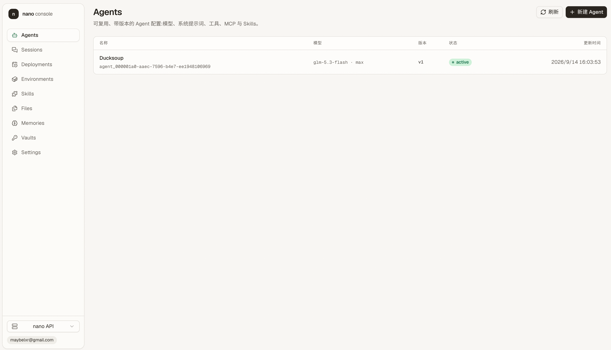

**会话 · 事件流** —— 三泳道时间线（输入 / 模型 / 工具）叠加紧凑的事件台账，右侧面板展示选中事件的完整载荷：

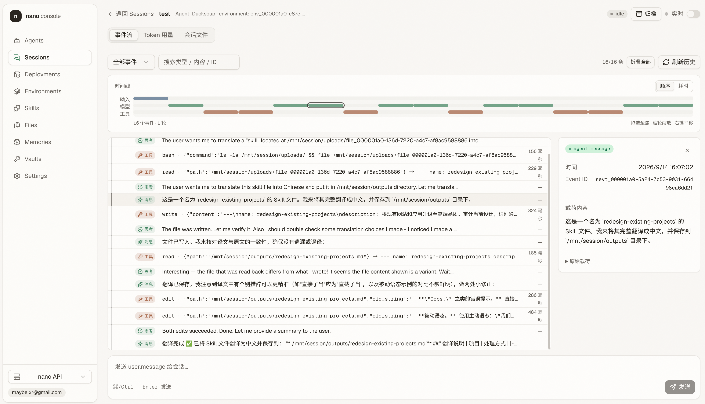

**会话 · Token 用量** —— 跨循环迭代累计的真实模型计量：

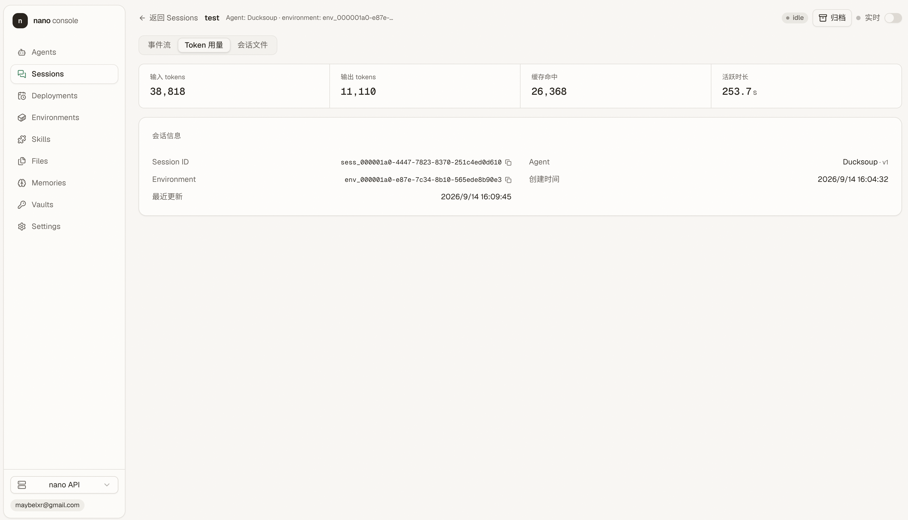

**会话 · 会话文件** —— 挂载资源与回合收尾收割的沙箱产出，均可下载：

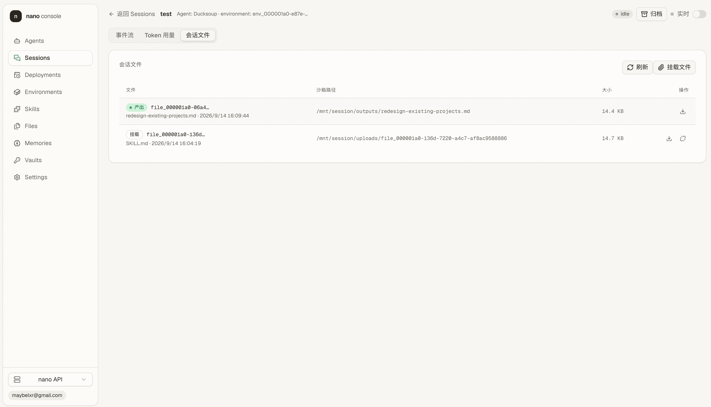

**文件库** —— 文件独立于会话生命周期，可挂载进任意新会话：

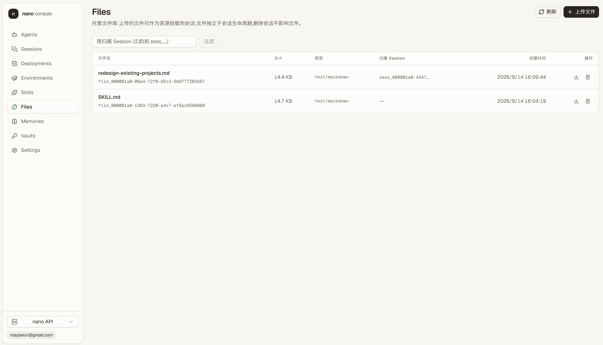

同一套界面也适配手机，随时随地跟进正在运行的会话：

<table>
  <tr>
    <td>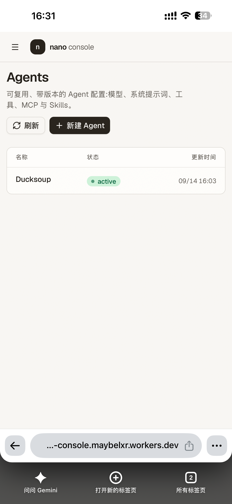</td>
    <td>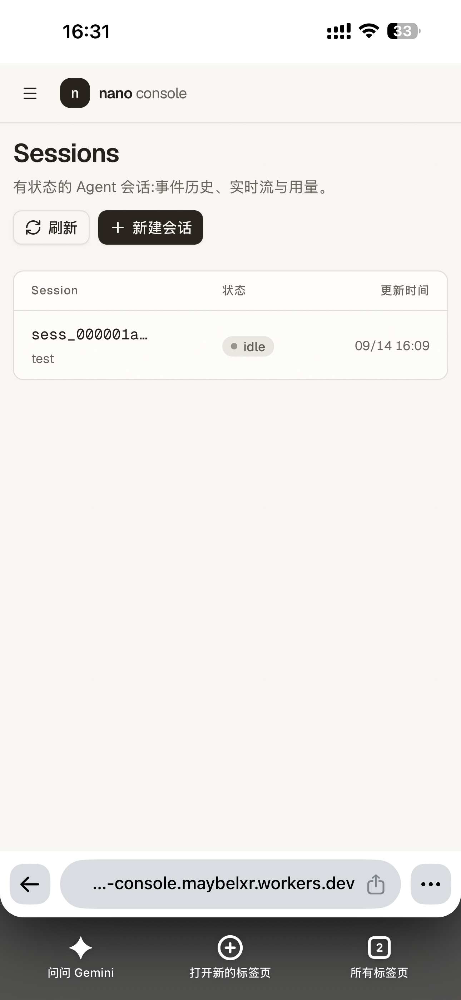</td>
    <td>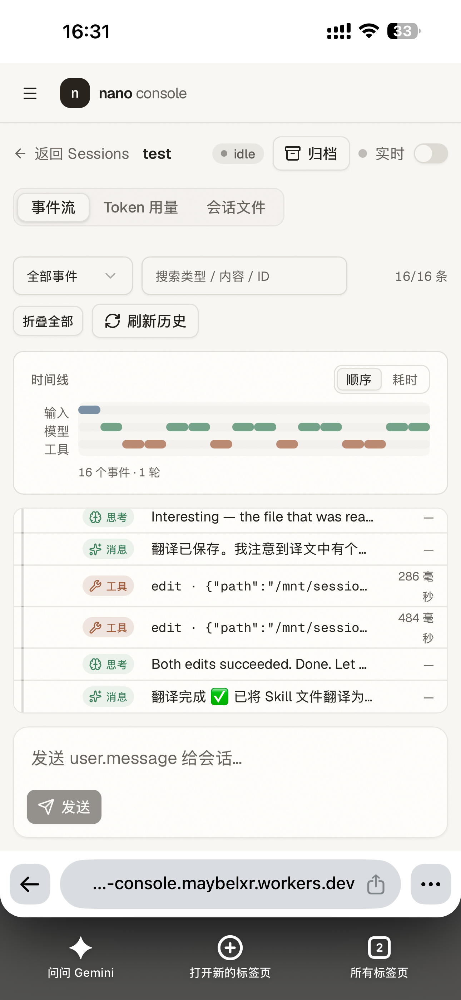</td>
    <td>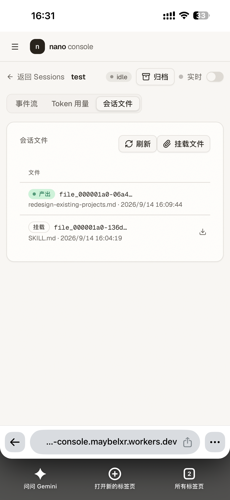</td>
    <td>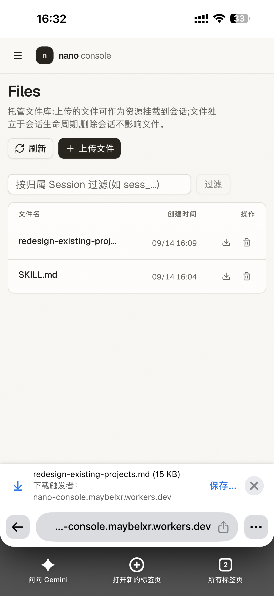</td>
  </tr>
  <tr>
    <td align="center">Agents</td>
    <td align="center">Sessions</td>
    <td align="center">会话 · 事件流</td>
    <td align="center">会话 · 文件</td>
    <td align="center">文件库</td>
  </tr>
</table>

## 架构

| Cloudflare 组件 | 在本项目中的角色 |
| --- | --- |
| Workers | API 网关（`apps/api`，Hono）：`/v1/agents`、`/v1/skills`、`/v1/files`、`/v1/environments`、`/v1/sessions` |
| Durable Objects | 每个 Session 一个（`SESSION_DO`）：状态机、事件历史、SSE 扇出、以及自管检查点与恢复的智能体循环执行。评估过 Workflows 并刻意不用——决策记录见 [`docs/session/runtime.md`](docs/session/runtime.md) §0 |
| Containers（Sandbox SDK） | 会话专属的工具沙箱，承载 bash 与文件工具 |
| D1 | 元数据：agents、skills、files（内容在 R2）、environments、sessions 与会话产出编目 |
| R2 | File 资源内容存储（`FILES` 绑定）；沙箱产出文件在每回合收尾时收割至此 |

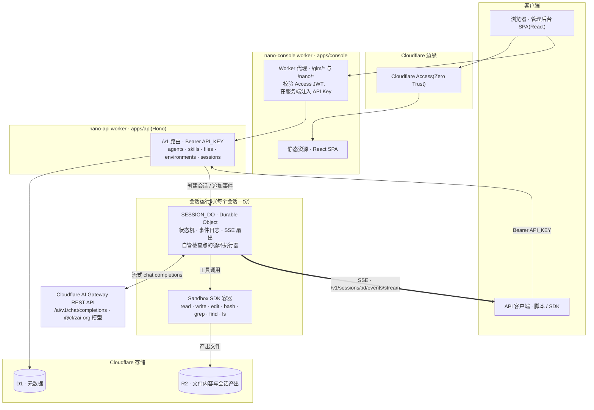

代码按「每个包只做一件事」分层：

| 组件 | 位置 | 职责 |
| --- | --- | --- |
| console worker（代理 + Access 校验） | `apps/console/src/worker/` | 接管 `/glm/*` 与 `/nano/*`，转发到所选后端 |
| console SPA | `apps/console/src/web/` | 管理界面（agents、sessions、skills、files 等） |
| api worker | `apps/api/src/` | Hono `/v1` 路由、auth 中间件、错误信封 |
| Drizzle schema + 仓储 | `packages/db/src/` | 全部 SQL 与事务边界 |
| zod 协议 + GLM DTO | `packages/shared/src/` | 前后端共用的类型 |

整体架构图、API 请求链路与 D1 数据模型的 Mermaid 图统一收录在 [`docs/architecture-diagrams.md`](docs/architecture-diagrams.md)。

## 目录结构

```
apps/
  api/            # nano-api — Cloudflare Worker(Hono):REST 控制面 + 会话运行时
  console/        # nano-console — 管理后台 SPA(React)+ worker 代理,部署在 Cloudflare Access 之后
packages/
  shared/         # 前后端共用的 API 类型与 zod schema
                  #   (./glm 子导出为 GLM Managed Agents DTO)
  db/             # Drizzle schema + D1 查询帮助函数 — SQL 只存在于这里
docs/             # 各模块的设计文档与逐端点的 API 参考
scripts/          # deploy.sh(一键部署)与 E2E 测试脚本
```

内部包以 TypeScript 源码形式直接消费，没有构建环节：`exports` 直接指向 `.ts` 文件，由 wrangler 与 Vite 在打包时处理。

## 环境要求

- **Node.js >= 20** 与 **pnpm**（`corepack enable` 启用，或 `npm i -g pnpm` 安装）。
- **一个 Cloudflare 账号。** 请注意：会话沙箱使用 Cloudflare Containers，目前需要 Workers 付费计划——免费账号在部署 `apps/api` 一步会失败。
- **Node.js >= 20** 与 **pnpm**（`corepack enable` 启用，或 `npm i -g pnpm` 安装）。
- **一个 Cloudflare 账号。** 注意会话沙箱使用 Cloudflare Containers，目前需要 Workers 付费计划——免费账号会在部署 `apps/api` 一步失败。
- **一个 Cloudflare API Token，权限勾选 Workers AI > Read 与 AI Gateway > Edit**（控制台 My Profile → API Tokens 创建）。智能体循环经 Cloudflare AI Gateway REST API 调用 Cloudflare 托管的 `@cf/zai-org/*` 模型；模型 id 保持 `glm-5.3` / `glm-5.3-flash` 不变，请求时按模型目录映射。`@cf` 模型请求必须携带 `cf-aig-gateway-id` 头，因此部署脚本会查找（凭 Edit 权限则自动创建）一个名为 `nano` 的网关并把 id 写进 `apps/api/wrangler.jsonc`。智谱 Key 只有 console 的 GLM 平台代理（`/glm/*`）才需要，与模型推理无关。

## 快速开始(本地开发)

```bash
git clone https://github.com/lgorthm/nano-managed-agent.git
cd nano-managed-agent
pnpm install

# 为 API worker 准备本地 secret
cp apps/api/.dev.vars.example apps/api/.dev.vars
#   API_KEY=dev-key-change-me           # 任选一个本地 Key
#   CLOUDFLARE_API_TOKEN=<真实 token>    # Workers AI Read;智能体循环的模型调用凭据
#   (CLOUDFLARE_ACCOUNT_ID / AI_GATEWAY_ID 在 apps/api/wrangler.jsonc 的 vars 里)

# 创建 D1 数据库(仅首次),把返回的 database_id 填入 apps/api/wrangler.jsonc,
# 然后在本地应用迁移
pnpm --filter @nano/api exec wrangler d1 create nano-api-db
pnpm db:migrate:local        # 迁移文件已入库;只有修改 packages/db 后才需要 pnpm db:generate

pnpm dev          # 同时启动 api(:8787,wrangler dev)与 console(:5173,vite)
```

要在本地使用管理后台，还需把 `apps/console/.dev.vars.example` 复制为 `.dev.vars`，并把 `NANO_API_KEY` 设为与 API 侧 `API_KEY` 相同的值（`ACCESS_DEV_BYPASS=1` 让 worker 在本地开发时跳过 Access JWT 校验——这个值严禁出现在任何生产配置里）。

其他常用命令：

```bash
pnpm dev:api         # 仅启动 api worker
pnpm dev:console     # 仅启动 console
pnpm test            # 依赖检查 + 全部包的测试(真实 Workers 运行时)
pnpm test:e2e        # 脚本级 E2E:会话完整生命周期 + SIGKILL 崩溃恢复
pnpm typecheck       # 全仓类型检查
pnpm types           # 修改 wrangler.jsonc 后重新生成各 app 的 worker-configuration.d.ts
pnpm run deploy      # 部署全部 app(裸 pnpm deploy 会命中 pnpm 内置命令,必须带 run)
```

## 五个请求走通核心闭环

在 `pnpm dev:api` 已启动、`NANO_API_KEY` 设为 `apps/api/.dev.vars` 中值的前提下：

```bash
export NANO=http://127.0.0.1:8787
export NANO_API_KEY=dev-key-change-me

# 1. Environment 声明沙箱里预装什么
ENV_ID=$(curl -sS "$NANO/v1/environments" \
  -H "Authorization: Bearer $NANO_API_KEY" -H "content-type: application/json" \
  -d '{"name":"scratch"}' | jq -r .id)

# 2. Agent 钉住模型、系统提示词与工具
AGENT=$(curl -sS "$NANO/v1/agents" \
  -H "Authorization: Bearer $NANO_API_KEY" -H "content-type: application/json" \
  -d '{
    "name": "Coding Assistant",
    "model": "glm-5.3",
    "system": "You are a helpful coding agent.",
    "tools": [{"type": "agent_toolset_20260601"}]
  }' | jq -r .id)

# 3. Session 把 Agent 与 Environment 的配置固化为快照
SESSION=$(curl -sS "$NANO/v1/sessions" \
  -H "Authorization: Bearer $NANO_API_KEY" -H "content-type: application/json" \
  -d "{\"agent\":\"$AGENT\",\"environment_id\":\"$ENV_ID\"}" | jq -r .id)

# 4. 订阅 SSE 事件流(在另一个终端保持运行)
curl -N "$NANO/v1/sessions/$SESSION/events/stream" \
  -H "Authorization: Bearer $NANO_API_KEY"

# 5. 发送一条消息;此后由平台驱动整个循环
curl -sS -X POST "$NANO/v1/sessions/$SESSION/events" \
  -H "Authorization: Bearer $NANO_API_KEY" -H "content-type: application/json" \
  -d '{"events":[{"type":"user.message","content":[{"type":"text","text":"列出沙箱里的文件。"}]}]}'
```

第 5 步立即返回持久化后的输入事件；回合本身在第 4 步打开的流上展开：`session.status_running` → `agent.thinking` → `agent.message`（文本以 `.delta` 帧流式到达）→ 模型调用工具时发出 `agent.tool_use` → 沙箱中执行 → `agent.tool_result` → 需要时继续下一轮模型迭代 → `session.usage` → `session.status_idle` 携带 `stop_reason` 告诉你这回合为何结束。回合期间写入 `/mnt/session/outputs` 的文件，会以可下载的 File 资源出现在 `/v1/files`。

## 一键部署到 Cloudflare

在装有 Node >= 20 与 pnpm 的机器上，首次部署与后续更新都只需要一条命令：

```bash
bash scripts/deploy.sh    # 等价于 pnpm deploy:init
```

脚本幂等、可放心重复执行。它会依次完成：

1. 前置检查（node / pnpm / wrangler 登录状态，交互终端下未登录会自动发起登录）。
2. 安装依赖。
3. 创建或复用 D1 数据库 `nano-api-db`，并把 `database_id` 写回 `apps/api/wrangler.jsonc`；创建或复用 R2 桶 `nano-files`。
4. 部署 `apps/api`（Durable Object 迁移与沙箱容器镜像随 deploy 一并完成），随后对远端 D1 应用全部迁移。
5. 设置 secret：`API_KEY`（缺失时自动生成 48 位十六进制并展示一次）、`CLOUDFLARE_API_TOKEN`（环境变量传入或交互输入）。脚本在更早的步骤还会把账号 ID 写回 `apps/api/wrangler.jsonc`，并查找或自动创建 `nano` 网关。
6. 把 console 的 `NANO_API_BASE` 接到刚部署的 API 地址，部署 `apps/console`。

已存在的资源与 secret 一律跳过；通过环境变量显式给出的值才会强制覆盖。支持的环境变量：

| 变量 | 含义 |
| --- | --- |
| `API_KEY` | nano API 自身的 Bearer 鉴权 Key |
| `CLOUDFLARE_API_TOKEN` | 模型服务凭据：Cloudflare API Token，需 Workers AI > Read（再加 AI Gateway > Edit 可让脚本自动创建网关） |
| `AI_GATEWAY_ID` | AI Gateway 网关 ID；缺省由脚本查找或自动创建名为 `nano` 的网关，写回 `apps/api/wrangler.jsonc` |
| `GLM_API_KEY` | GLM（智谱开放平台）Key，仅 console 的 GLM 平台代理使用，https://bigmodel.cn |
| `NANO_API_KEY` | console 连接 nano API 用的 Key（缺省复用 `API_KEY` 的值） |
| `NANO_API_BASE` | nano API 上游地址；缺省用 API 部署输出的 workers.dev 地址 |
| `CF_ACCESS_TEAM_DOMAIN` | Cloudflare Access 团队域名，`https://<team>.cloudflareaccess.com` |
| `CF_ACCESS_AUD` | Cloudflare Access 应用的 Audience（AUD）Tag |

有两件事脚本代替不了：

- **会话沙箱依赖 Cloudflare Containers，需要 Workers 付费计划。** 免费账号会在 `apps/api` 部署一步失败。
- **console 登录依赖的 Cloudflare Access 应用需在 Zero Trust 控制台手动创建一次**（步骤见 [`docs/console.md`](docs/console.md)）。换账号部署时，请通过 `CF_ACCESS_TEAM_DOMAIN` / `CF_ACCESS_AUD` 传入本账号的值后重跑脚本。

## 文档

`docs/` 目录承载了完整的设计记录；每个模块都有 schema、模块结构与逐端点的 API 参考：

| 板块 | 内容 |
| --- | --- |
| [`docs/architecture-diagrams.md`](docs/architecture-diagrams.md) | 整体架构、请求链路与 D1 数据模型的 Mermaid 图 |
| [`docs/agent/`](docs/agent/api/README.md) | 智能体：schema、API（6 个端点）、结构、实现计划 |
| [`docs/skills/`](docs/skills/api/README.md) | 技能：multipart zip 上传、不可变目录快照、API（9 个端点） |
| [`docs/files/`](docs/files/api/README.md) | 文件：上传下载、会话产出编目、API（5 个端点） |
| [`docs/environment/`](docs/environment/api/README.md) | 环境：沙箱软件包与出网策略、API（6 个端点） |
| [`docs/session/`](docs/session/api/README.md) | 会话：13 个端点；[`runtime.md`](docs/session/runtime.md) 是事件模型、流式输出与循环执行器的定稿设计 |
| [`docs/console.md`](docs/console.md) | 管理后台的部署与 Cloudflare Access 配置 |

## 参与贡献

欢迎提交 Issue 与 Pull Request。仓库遵循文档先行的工作方式——有意义的改动先落在 `docs/` 下的设计说明里（各模块的 `work-plan.md` 记录着已完成与下一步），且每次改动都应保持 `pnpm typecheck`、`pnpm test` 与 `pnpm test:e2e` 全绿。

## 许可证

本项目基于 [MIT License](LICENSE) 发布。
