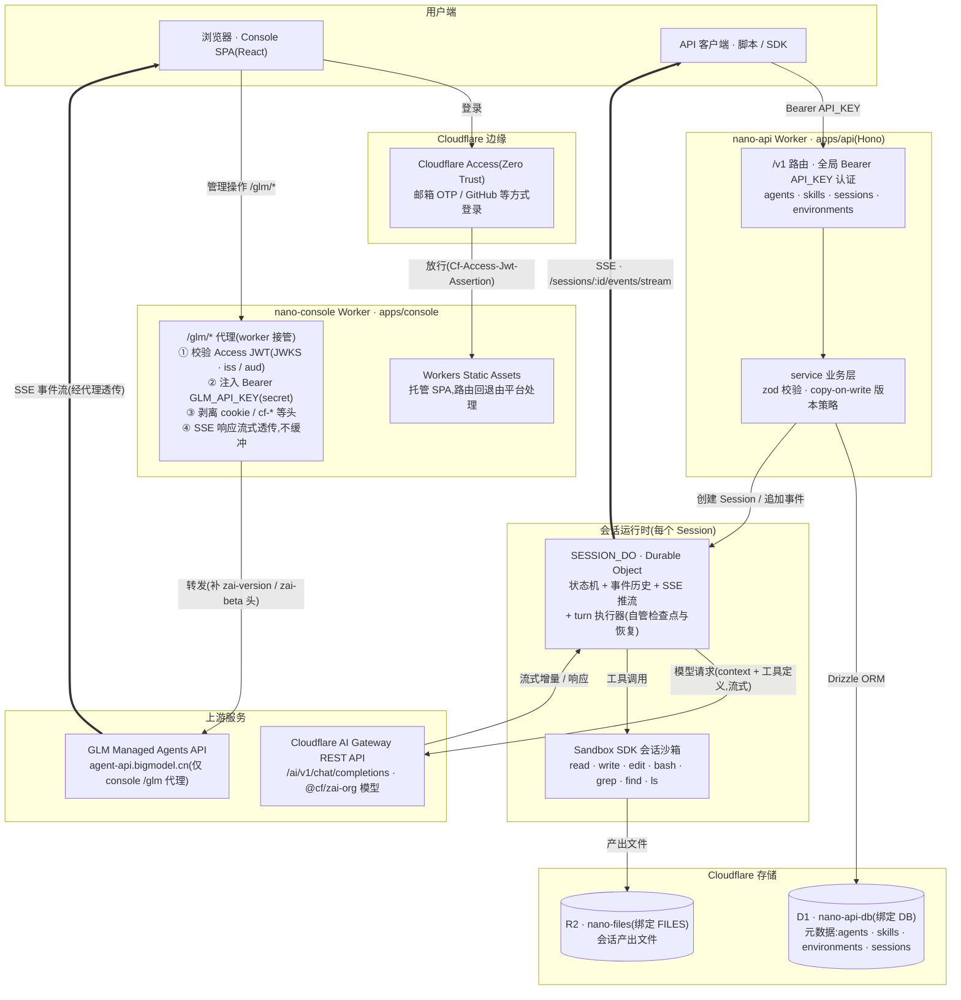
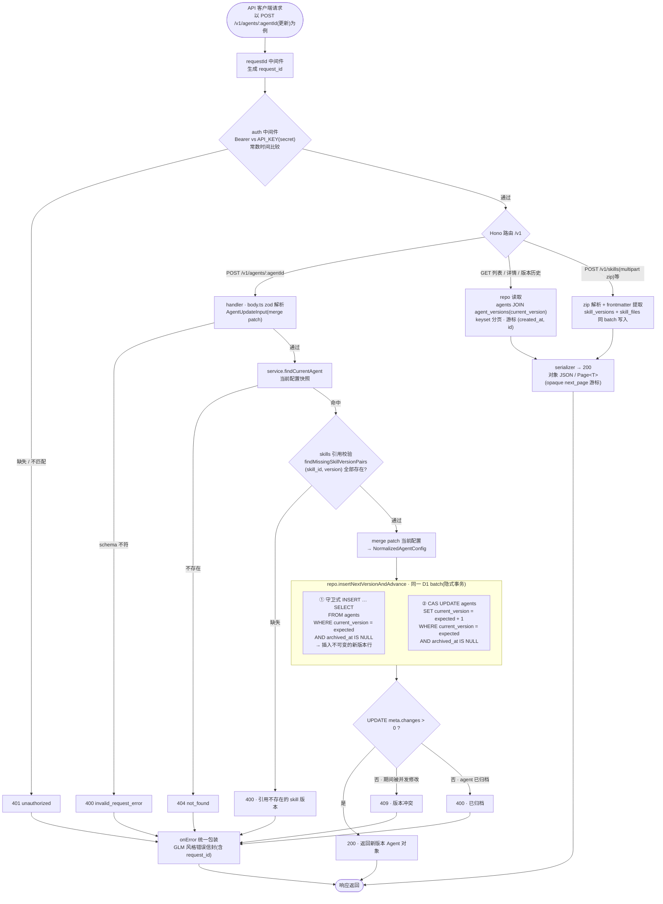
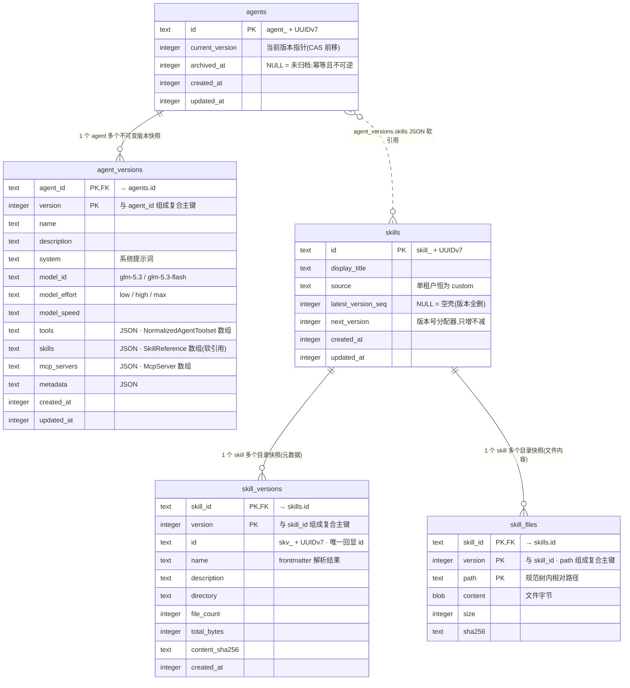

# 架构图与流程图

本文用 Mermaid 描述 nano-managed-agent 的整体目标架构、nano-api 的请求链路,以及 D1 数据模型。
图中的绑定名(`DB`、`SESSION_DO`、`FILES`)、路由、表名均与仓库代码一一对应。

## 1. 总目标架构

系统分四个平面:

- **管理面**(nano-console):浏览器经 Cloudflare Access 登录后使用 React SPA;SPA 的所有 API 调用走同源 `/glm/*` 代理,由 Worker 校验 Access JWT、注入 `GLM_API_KEY` 后转发到 GLM Managed Agents API,密钥永不进浏览器,SSE 流式透传。
- **API 平面**(nano-api):Hono Worker,`/v1` 路由以 `API_KEY` Bearer 认证,管理 agents / skills / sessions 等元数据,落在 D1。
- **会话运行时**:每个 Session 一个 `SESSION_DO` Durable Object——状态机、事件历史、SSE 推流与 Agent 循环执行(turn 执行器自管两级检查点与崩溃恢复,不使用 Workflows,见 [session/runtime.md](session/runtime.md));工具在 Sandbox SDK 会话沙箱中运行;产出文件写 R2。
- **模型服务**:Agent 循环经 Cloudflare AI Gateway REST API(`/accounts/{id}/ai/v1/chat/completions`,OpenAI chat 格式)调用 Cloudflare 托管的 `@cf/zai-org/*` 模型;存量模型 id `glm-5.3` / `glm-5.3-flash` 不变,wire 侧按模型目录映射。

代码分层(`apps/*` 是传输层,`packages/db` 是唯一 SQL 出处,`packages/shared` 是协议层):

| 组件 | 位置 | 职责 |
| --- | --- | --- |
| console worker(代理 + Access 校验) | `apps/console/src/worker/` | 接管 `/glm/*`,转发 GLM |
| console SPA | `apps/console/src/web/` | 管理界面(agents / sessions / skills / files / memories / vaults …) |
| api worker | `apps/api/src/` | Hono `/v1` 路由、auth、错误信封 |
| Drizzle schema + repo | `packages/db/src/` | 全部 SQL 与事务边界 |
| zod 协议 + GLM DTO | `packages/shared/src/` | 前后端共用类型 |

## 2. nano-api 请求链路

通用骨架:requestId 中间件 → Bearer 认证(常数时间比较)→ 模块路由 → zod 解析 → service → Drizzle repo → D1;任何一层抛错都由 `onError` 统一包装成 GLM 风格错误信封(含 `request_id`)。

Agent 更新走 **copy-on-write**:版本行是不可变快照,更新 = 插入新版本行 + CAS 前移 `agents.current_version` 指针,两条语句放进同一个 D1 batch(SQLite 隐式事务);期间被并发修改则守卫条件落空、两条语句空转,上层转 409。

关键实现:`apps/api/src/routes/v1.ts`(认证与挂载)、`apps/api/src/modules/agent/service.ts`(业务规则与冲突转译)、`packages/db/src/agent/repo.ts:170`(`insertNextVersionAndAdvance`)。归档是幂等的终止操作,没有取消归档路径。

## 3. D1 数据模型

五张表、两组"实体 + 不可变版本快照"结构。Agent 对 Skill 的引用不是外键,而是 `agent_versions.skills` JSON 列中的 `SkillReference{skill_id, version}`,写入时由 `findMissingSkillVersionPairs` 校验存在性。

约束要点:

- 版本行写入后不可变,任何更新都产生新版本,绝不改写历史快照。
- `skill_versions` 与 `skill_files` 在同一个 D1 batch 中写入 / 删除,保证目录快照原子。
- 分页统一走 keyset 游标(agents 按 `(created_at, id)`,版本列表按 `version` 单列),游标以 opaque `next_page` 形式返回。
